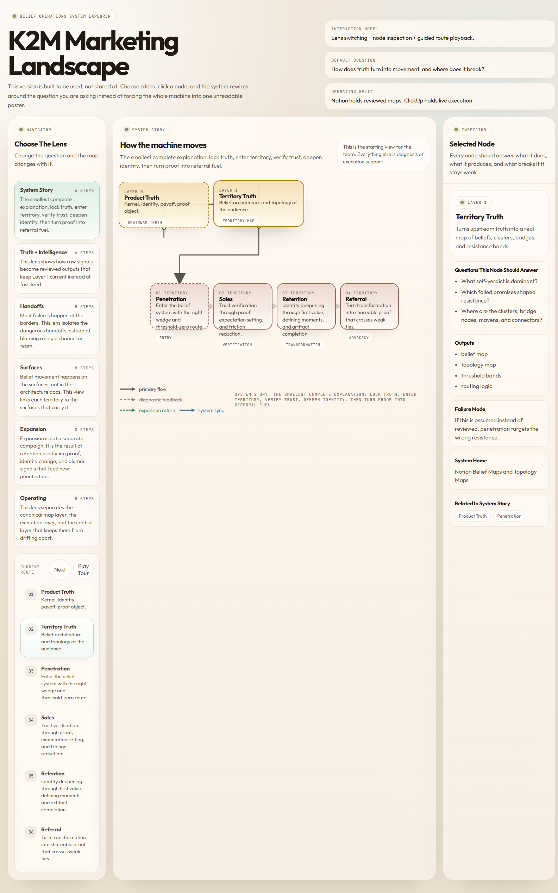

# K2M Marketing Landscape Explorer

*Status: reconciled supporting visual summary aligned to PRD v0.2 - 2026-04-10*

This is an interactive system explorer for the K2M belief-operations landscape.

It is a visual summary aid, not the canonical operating contract.
For decisions about what gets built or what counts as implemented, defer to:

1. `canon/` for philosophy
2. `k2m-belief-operations-execution-prd.md` for implementation scope
3. `k2m-belief-operations-os.md` and `k2m-runtime-state.md` for operating interpretation and live-state truth

It lets the team inspect the architecture through focused lenses instead of one overloaded diagram:

- upstream truth
- live intelligence
- the four territories
- border diagnostics
- the expansion loop
- the operating layers in Notion and ClickUp

Primary artifact:

- [Open the interactive HTML map](./k2m-marketing-landscape-process-flow.html)

The HTML explorer is lens-based:

- `System Story` for the smallest complete explanation of the machine
- `Truth + Intelligence` for map refresh and reviewed market sensing
- `Handoffs` for border failures
- `Surfaces` for where each territory is actually experienced
- `Expansion` for compounding and re-entry
- `Operating` for the Notion / ClickUp / governance split

Interaction model:

- choose a lens from the left rail
- click a node to inspect what it does, what it produces, and what breaks if it stays weak
- use `Next` or `Play Tour` to walk the current route

Preview:

Fallback static asset:

- [Open the SVG version](./k2m-marketing-landscape-process-flow.svg)

## Reading Guide

- Start in `System Story`. That is the cleanest team-facing summary.
- Use `Truth + Intelligence` to understand how assumptions become reviewed territory truth.
- Use `Handoffs` to see where the system can break between territories.
- Use `Surfaces` when you need to align messages, artifacts, and touchpoints.
- Use `Expansion` to understand how retention should generate the next growth wave.
- Use `Operating` to separate canonical truth management from live execution.

## Canonical Summary

K2M is not running a normal funnel.

It is running a belief-and-topology system:

1. establish Phase 0 Product Truth coverage before claiming deep implementation readiness
2. lock active Product Truth for the beachhead audience
3. map territory truth in Four Forces form with evidence tiers and disconfirmation
4. move from intelligence into penetration and sales with trust verification
5. route intelligence into real last-mile outputs: content, product friction fixes, retention interventions, referral assets, and map updates
6. check external reality through cohort application rate, DM reply rate, and other downstream metrics
7. update the map and run the loop again

If this visual summary ever drifts from the PRD or runtime-state docs, update the visual artifact or treat it as stale.
